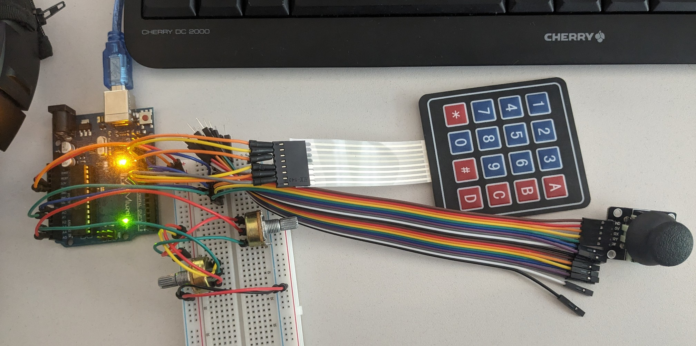
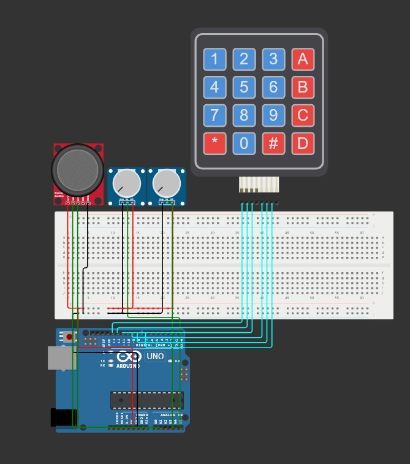

# Simple Arduino-based MIDI Controller

This is the source code of my first Arduino project which uses a couple of inputs to generate MIDI to be passed onto a DAW (tested with Bitwig Studio 5 on Windows).

## Prerequisites

The project was made with the following hardware:

- [Miuzei R3 Uno Starter Kit](https://amzn.eu/d/6Cfzlgt)
- 4x4 matrix keyboard
- 2x 10k potentiometers
- Analog joystick

You will need the following libraries:

- [MIDI Library by Francois Best, lathoub](https://github.com/FortySevenEffects/arduino_midi_library)

- [Keypad by Mark Stanley, Alexander Brevig](https://github.com/Chris--A/Keypad)

The following software will also be required to translate the serial readout into MIDI and feed it into a DAW:

- [Hairless MIDI to Serial Bridge](https://projectgus.github.io/hairless-midiserial/)

- [loopMIDI](https://www.tobias-erichsen.de/software/loopmidi.html)

## Usage

Refer to the supplied `wokwi` folder for a pinout reference. Modifying the source code also allows changing the MIDI CC channels and which notes are triggered by the keypad.